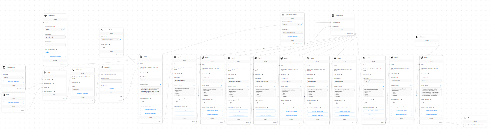

# Project Description

This is an application built on the **Flowise** platform, designed to analyze websites based on **47 parameters**. Each agent is responsible for analyzing specific characteristics of the site, enabling a detailed and comprehensive analysis.

## Architecture Overview

The application is built using:

- **Flask**: A web framework for handling HTTP requests.
- **Flowise**: A platform for creating flow-based processes using agents and tools.
- **Agents**: Modules that analyze specific parameters of the site.
- **Tools**: Additional means for collecting and processing information.

## Main Components

### Flask Application (`app.py`)

The Flask application provides an API for receiving requests to analyze websites. The main endpoints include:

- `POST /parse`: Accepts a website URL for analysis and initiates the process.

Sample code of the route handler:

```python:app.py
from flask import Flask, request, jsonify, send_from_directory, abort, url_for
from parser import parse_website
import os

app = Flask(__name__)

# Directory where screenshots are stored
SCREENSHOTS_DIR = 'screenshots'

@app.route('/parse', methods=['POST'])
def parse_route():
    data = request.get_json()
    url = data.get('url')
    if not url:
        return jsonify({'error': 'URL not provided'}), 400
    try:
        result = parse_website(url)
        
        screenshot_filename = result.get('screenshot_filename')
        if screenshot_filename:
            # Form the full URL to the screenshot
            screenshot_url = url_for('serve_screenshot', filename=screenshot_filename, _external=True)
            result['screenshot_url'] = screenshot_url
            # Remove the filename from the result as we now have the URL
            del result['screenshot_filename']
        else:
            result['screenshot_url'] = None

        return jsonify(result)
    except Exception as e:
        return jsonify({'error': str(e)}), 500

@app.route('/screenshots/<path:filename>')
def serve_screenshot(filename):
    # Check if the file exists
    if not os.path.exists(os.path.join(SCREENSHOTS_DIR, filename)):
        abort(404)
    return send_from_directory(SCREENSHOTS_DIR, filename)
```

### Agents

Each agent in the system is responsible for analyzing specific parameters of the site. They work sequentially, passing results to each other for a comprehensive analysis.

## List of Agents and Their Tasks

1. **Parser**:
   - **Task**: Collects basic information about the site and passes it to the next agents for further analysis.
   - **Used Tools**: Custom tool `getting_information_about_the_site`.

2. **Structural Relevance**:
   - **Task**: Analyzes the site structure, checks navigation logic, and user experience.
   - **Used Tools**: `WebBrowser`.

3. **Links Relevance**:
   - **Task**: Evaluates the quality and relevance of links on the site, both internal and external.
   - **Used Tools**: `WebBrowser`.

4. **Technical Quality**:
   - **Task**: Checks technical aspects of the site, including load speed, error presence, and use of modern technologies.
   - **Used Tools**: `WebBrowser`.

5. **Search Division**:
   - **Task**: Analyzes the site's optimization for search engines (SEO), checks metadata, and keyword usage.
   - **Used Tools**: `WebBrowser`.

6. **Color Relevance**:
   - **Task**: Evaluates the site's color scheme usage and its correspondence to the theme and branding.
   - **Used Tools**: `WebBrowser`.

7. **Fonts Relevance**:
   - **Task**: Analyzes the fonts used, their readability, and compliance with the site's overall style.
   - **Used Tools**: `WebBrowser`.

8. **Images Relevance**:
   - **Task**: Assesses the quality and optimization of images, their relevance to the content.
   - **Used Tools**: `WebBrowser`.

9. **Texts Relevance**:
   - **Task**: Analyzes textual content for uniqueness, grammatical errors, and stylistic compliance.
   - **Used Tools**: Processing is performed directly by the agent without additional tools.

10. **Chief Analyzer**:
    - **Task**: Collects and summarizes the results of all previous agents, forming a final report with recommendations.
    - **Used Tools**: `Calculator` for data processing and metric calculations.

## Application Workflow

1. **Receiving the Request**: The user sends a POST request to the `/parse` endpoint with JSON data containing the site's URL.

2. **Initiating Analysis**: The Flask application calls the function `parse_website(url)`, which starts the sequential analysis process.

3. **Agents Execution**: Agents are launched sequentially; each processes its part of the analysis and passes data to the next agent.

4. **Data Collection and Processing**: Tools linked to the agents collect necessary information from the site for analysis.

5. **Report Formation**: The final agent, **Chief Analyzer**, processes all collected data and forms a detailed report.

6. **Returning Results**: The Flask application sends a JSON response to the user with the analysis results and, if available, a link to the site's screenshot.

## Installation and Launch

### Requirements

- Python 3.x
- Installed dependencies from the `requirements.txt` file (if available)

### Installing Dependencies

```bash
pip install -r requirements.txt
```

### Running the Application

```bash
python app.py
```

## Usage

### Sending a Request for Analysis

Example request using `curl`:

```bash
curl -X POST -H "Content-Type: application/json" -d '{"url": "https://example.com"}' http://localhost:5000/parse
```

### Application Response

The application will return JSON with the analysis results, for example:

```json
{
  "structural_relevance": { ... },
  "links_relevance": { ... },
  "technical_quality": { ... },
  "search_division": { ... },
  "color_relevance": { ... },
  "fonts_relevance": { ... },
  "images_relevance": { ... },
  "texts_relevance": { ... },
  "final_report": { ... },
  "screenshot_url": "http://localhost:5000/screenshots/example.com.png"
}
```

## Additional Information

- **Custom Tools**: The `getting_information_about_the_site` tool allows collecting specific information necessary for analysis.

- **Integration with `WebBrowser`**: Many agents use the `WebBrowser` tool to access and collect data directly from websites.

- **Extensibility**: Thanks to the modular architecture, new agents and tools can be easily added to extend the analysis functionality.

### Example of a Custom Tool (`parser.py`)

```python:parser.py
def get_screenshot_url(url):
    params = urlencode({
        "access_key": "YOUR_API_KEY",  # Replace with your API key
        "url": url,
        "full_page": "true",
        "delay": "5"
    })
    return f"https://api.apiflash.com/v1/urltoimage?{params}"

def get_page_load_time(url):
    start_time = time.time()
    requests.get(url)
    return time.time() - start_time

def has_ssl(url):
    return urlparse(url).scheme == "https"

def get_meta_tags(soup):
    meta_tags = {}
    for tag in soup.find_all('meta'):
        if 'name' in tag.attrs:
            meta_tags[tag.attrs['name']] = tag.attrs.get('content', '')
        elif 'property' in tag.attrs:
            meta_tags[tag.attrs['property']] = tag.attrs.get('content', '')
    return meta_tags

def is_mobile_friendly(url):
    mobile_options = Options()
    mobile_emulation = {"deviceName": "Nexus 5"}
    mobile_options.add_experimental_option("mobileEmulation", mobile_emulation)
    mobile_options.add_argument('--headless')
    mobile_options.add_argument('--no-sandbox')
    mobile_options.add_argument('--disable-dev-shm-usage')
    driver = webdriver.Chrome(options=mobile_options)
    driver.set_page_load_timeout(30)
    try:
        driver.get(url)
        time.sleep(2)
        is_friendly = True  # Implement logic to determine mobile-friendliness
    except Exception:
        is_friendly = False
    finally:
        driver.quit()
    return is_friendly
```

## Conclusion

This application provides a complete analysis of websites across numerous parameters, making it a valuable tool for web developers, SEO specialists, and website owners aiming to improve the quality and efficiency of their resources.

## Contact

If you have any questions or suggestions for improving the application, please contact us.
 